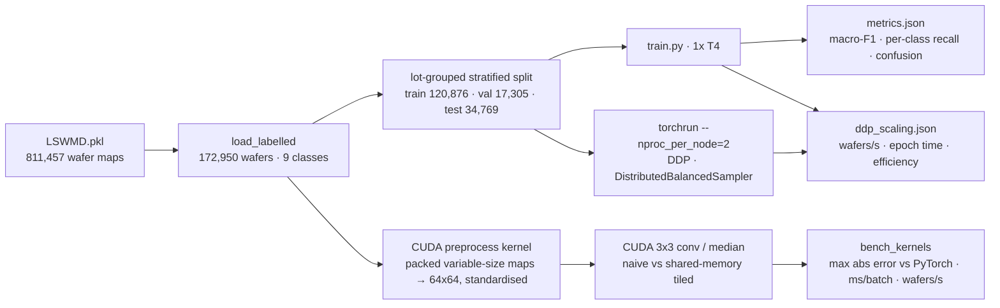

# wafer-defect-cuda


[](https://github.com/Sim2200/wafer-defect-cuda/actions)

Wafer-map defect pattern classification on the public **WM-811K** dataset (811,457 real wafer maps
from a semiconductor fab, 172,950 labelled with one of nine failure patterns), with **custom CUDA
kernels** for preprocessing and filtering written as a PyTorch C++/CUDA extension, and
**multi-GPU training with PyTorch DDP**. Every number below is read from a file under `results/`,
produced by one run on Kaggle's free 2x Tesla T4 (`kaggle/run_all.py`), including the kernels'
correctness checks against PyTorch. `INTERVIEW.md` explains the kernel layout, the tiling result,
the bug the correctness check caught, and the DDP numbers in plain words.

## Why wafer-map patterns matter

After electrical test, every die on a wafer is marked pass or fail. The spatial pattern of the
failures is a fingerprint of the process problem: an **Edge-Ring** points at edge-bead removal or
etch non-uniformity, a **Scratch** at handling, a **Center** blob at deposition or chuck
temperature, **Random** at particle contamination. Classifying the pattern automatically lets yield
engineers route a lot to the right tool owner without inspecting maps by hand. The hard part is
the class balance: **85.2%** of labelled wafers are "none", and the rarest pattern (Near-full) has
149 wafers in the whole dataset.

## Architecture



## Kernel design

All kernels live in `kernels/wafer_ops.cu` and are built with `torch.utils.cpp_extension.load`.

- **Thread/block layout.** A 2-D block of 16x16 threads computes one 16x16 output tile; `grid.x`
  and `grid.y` tile the image and `grid.z` indexes the batch, so one launch covers 1,024 wafers.
  Consecutive threads in a warp own consecutive columns of a row, so global loads and stores are
  **coalesced** into a few 128-byte transactions per warp.
- **Preprocess** (`resize_kernel` + `standardise_kernel`). Wafer maps come in hundreds of sizes
  (26x26 is the most common; see `results/data_summary.json`), so they are packed into one flat
  uint8 buffer with height/width/offset tables. The resize kernel maps each output pixel to its
  source with the nearest-exact rule PyTorch uses, which is what makes an exact comparison
  possible. Standardisation is one block per wafer: each thread accumulates partial sums of x and
  x² over a strided range, a **shared-memory tree reduction** yields mean and variance, and the
  same threads write back `(x - mean) / (std + eps)`.
- **conv3x3 and median3x3**, each in a *naive* version (nine global reads per output pixel,
  boundary handled per pixel: zero padding for the conv, replicate for the median) and a
  **shared-memory tiled** version (each block stages an 18x18 tile, the 16x16 output tile plus a
  one-pixel halo, in shared memory behind one `__syncthreads()`, then reads neighbours from shared
  memory, so each input pixel is fetched from global memory once per tile instead of up to nine
  times). The median is a fixed 19-comparison sorting network: branch-free, no local-memory array.

## Results

Run on 2026-10-03, Kaggle, 2x Tesla T4, torch 2.11.0+cu128, CUDA 12.8, Python 3.13 (`results/env.json`).

### Data (`results/data_summary.json`)

| | Center | Donut | Edge-Loc | Edge-Ring | Loc | Near-full | Random | Scratch | none |
|---|---|---|---|---|---|---|---|---|---|
| All labelled | 4,294 | 555 | 5,189 | 9,680 | 3,593 | 149 | 866 | 1,193 | 147,431 |
| Test set | 935 | 112 | 1,027 | 1,956 | 752 | 30 | 196 | 241 | 29,520 |

172,950 labelled wafers from 10,762 lots, split by lot (no lot straddles train and test),
stratified per class: train 120,876, val 17,305, test 34,769. "none" is 85.2% of the data.

### Kernels: correctness and speed (`results/kernels.json`, `results/cuda_tests.txt`)

Batch of 1,024 real 64x64 wafers, CUDA-event timing, median of 3 repeats of 50 launches each.
Max abs error is against the PyTorch reference on the same batch; the 5 CUDA parity tests in
`tests/test_kernels_cuda.py` passed on the T4 (`cuda_tests.txt`).

| Op | Variant | Max abs error vs PyTorch | ms / batch | Wafers / s |
|---|---|---|---|---|
| conv3x3 | PyTorch (cuDNN) | – | **0.232** | 4,413,111 |
| conv3x3 | CUDA naive | 0.0 | 0.376 | 2,725,172 |
| conv3x3 | CUDA tiled (shared memory) | 0.0 | 0.535 | 1,915,521 |
| median3x3 | PyTorch (unfold + median) | – | 99.109 | 10,332 |
| median3x3 | CUDA naive | 0.0 | **0.143** | 7,148,857 |
| median3x3 | CUDA tiled (shared memory) | 0.0 | 0.289 | 3,548,616 |
| preprocess | PyTorch (per-wafer loop: interpolate + mean/std) | – | 132.061 | 7,754 |
| preprocess | CUDA packed (resize + standardise, 2 launches) | 2.4e-7 | **0.294** | 3,482,379 |

Three honest readings. The custom **median filter is 693x faster** than PyTorch's unfold route
(99.1 vs 0.143 ms), because PyTorch has no fused median and must materialise nine shifted copies of
the batch. The packed **preprocess is 449x faster** than the per-wafer PyTorch loop (132 vs 0.294
ms); part of that gap is Python loop and kernel-launch overhead on the PyTorch side, which is
exactly the overhead a packed kernel removes, but it is not a like-for-like kernel comparison.
And **cuDNN beats both hand-written 3x3 convolutions** (0.232 vs 0.376 ms): a direct convolution
is a teaching kernel next to cuDNN's implicit-GEMM and Winograd paths.

**Tiling did not pay at this size.** For a 3x3 window on 64x64 maps the naive kernels are faster
than the tiled ones (median 0.143 vs 0.289 ms). A 64x64 float map is 16 KB and the T4 has 64 KB of
L1 per SM, so the naive kernel's nine reads per pixel mostly hit L1; the tiled kernel pays for the
halo loads, the barrier and shared-memory traffic to buy a reuse the cache already provided. Tiling
pays when reuse per pixel outgrows L1: larger windows (7x7), larger images, or several filters
sharing one tile. Both versions are kept because measuring this is the point.

**The correctness check earned its keep.** The first run reported max error 1.0 for the tiled
median: in its halo load, `blockIdx.y * TILE + ly - 1` is unsigned arithmetic, so "row minus one"
at the top edge wrapped to a huge value and clamped to the last row. Casting to `int` first fixed
it (commit history has both runs).

### Classification (`results/metrics.json`, `results/run_1gpu.json`)

Compact CNN (4 conv blocks, 390,633 parameters), 6 epochs, batch 256, AdamW + OneCycle, AMP,
inverse-frequency balanced sampling. Held-out test set, 34,769 wafers:

| | Value |
|---|---|
| **Macro-F1** | **0.8601** |
| Macro recall | 0.8831 |
| Accuracy | 0.9642 (the all-"none" baseline would be 0.849) |

| Class | Support | Precision | Recall | F1 |
|---|---|---|---|---|
| Center | 935 | 0.880 | 0.941 | 0.910 |
| Donut | 112 | 0.856 | 0.848 | 0.852 |
| Edge-Loc | 1,027 | 0.709 | 0.886 | 0.788 |
| Edge-Ring | 1,956 | 0.958 | 0.964 | 0.961 |
| Loc | 752 | 0.646 | 0.783 | 0.708 |
| Near-full | 30 | 0.936 | 0.967 | 0.951 |
| Random | 196 | 0.898 | 0.857 | 0.877 |
| Scratch | 241 | 0.697 | 0.726 | 0.711 |
| none | 29,520 | 0.992 | 0.975 | 0.984 |


The misses are the physically ambiguous neighbours: Loc vs Edge-Loc vs none, and faint Scratches
read as none. Balanced sampling trades a little "none" precision (0.992) for defect recall above
0.72 on every class. Validation accuracy swings in the early epochs (OneCycle's peak learning rate
with batch norm) and settles by epoch 4; the final epoch's validation macro-F1 is 0.861.

### Distributed training (`results/ddp_scaling.json`)

Same model, same per-rank batch (256, so the global batch doubles), same 6 epochs; throughput is
wafers seen by all ranks per second, averaged over epochs after the first.

| | 1x T4 | 2x T4 (DDP, NCCL) |
|---|---|---|
| Wafers / s | 10,060.9 | **18,175.7** |
| Mean epoch time (excl. first) | 12.02 s | 6.65 s |
| Total training time | 77.7 s | 45.6 s |
| Test macro-F1 | 0.8601 | 0.8527 |
| Test accuracy | 0.9642 | 0.9608 |

**Speedup 1.807x, scaling efficiency 90.3%.** The missing 10% is the NCCL all-reduce of the
gradients on a model whose steps are short (0.4M parameters, 64x64 inputs). Accuracy is within
run-to-run noise of the single-GPU run; each configuration was trained once (one seed), so the
0.007 F1 gap is not a finding.

## Limitations

- Tesla T4s (Turing, 2018), not A100/H100; one node; no NVLink. Scaling across nodes is untested.
- 6 epochs, one seed per configuration, no hyper-parameter search; macro-F1 would move by a point
  or two across seeds, and Near-full's per-class numbers rest on 30 test wafers.
- 85% "none" is the dataset's reality; balanced sampling changes the training distribution, not
  the test set, and the reported "none" precision/recall reflect that trade.
- The preprocess speedup includes PyTorch-side Python overhead; the conv comparison shows the
  custom kernels lose to cuDNN, and tiling did not help at 3x3 / 64x64. No Nsight profile yet.

## Running it

```bash
make setup && make test                  # CPU unit tests (CUDA parity tests skip without a GPU)
python scripts/run_on_kaggle.py --user <kaggle-username> --epochs 6
# pushes src/ kernels/ tests/ as a private Kaggle dataset, runs kaggle/run_all.py on 2x T4,
# waits, and pulls results/*.json, confusion_matrix.png and cuda_tests.txt back (about 6 minutes)
```

Needs a Kaggle account with phone verification (for GPUs) and the Kaggle CLI authenticated
(`~/.kaggle/access_token` or `kaggle.json`; never committed). On a machine with an NVIDIA GPU the
same steps run locally: `python -m wafer.bench_kernels ...`, `python -m wafer.train ...`,
`torchrun --nproc_per_node=2 -m wafer.train ...`.

## Layout

```
src/wafer/     data.py (load, lot-grouped split) · reference.py (PyTorch references) · kernels.py (extension wrapper)
               model.py · sampler.py (DistributedBalancedSampler) · train.py (DDP, AMP) · bench_kernels.py · metrics.py
kernels/       wafer_ops.cu (preprocess, conv3x3 naive/tiled, median3x3 naive/tiled)
kaggle/        run_all.py (the whole experiment on one kernel)      scripts/run_on_kaggle.py (push, poll, pull)
tests/         CPU tests (23) + CUDA parity tests (5, run on Kaggle)
results/       data_summary · kernels · metrics · run_1gpu · run_2gpu · ddp_scaling · env · cuda_tests.txt · confusion_matrix.png
```

## Author

**Simran Kharbanda** · [github.com/Sim2200](https://github.com/Sim2200)
