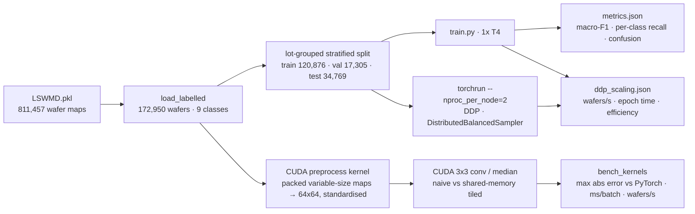
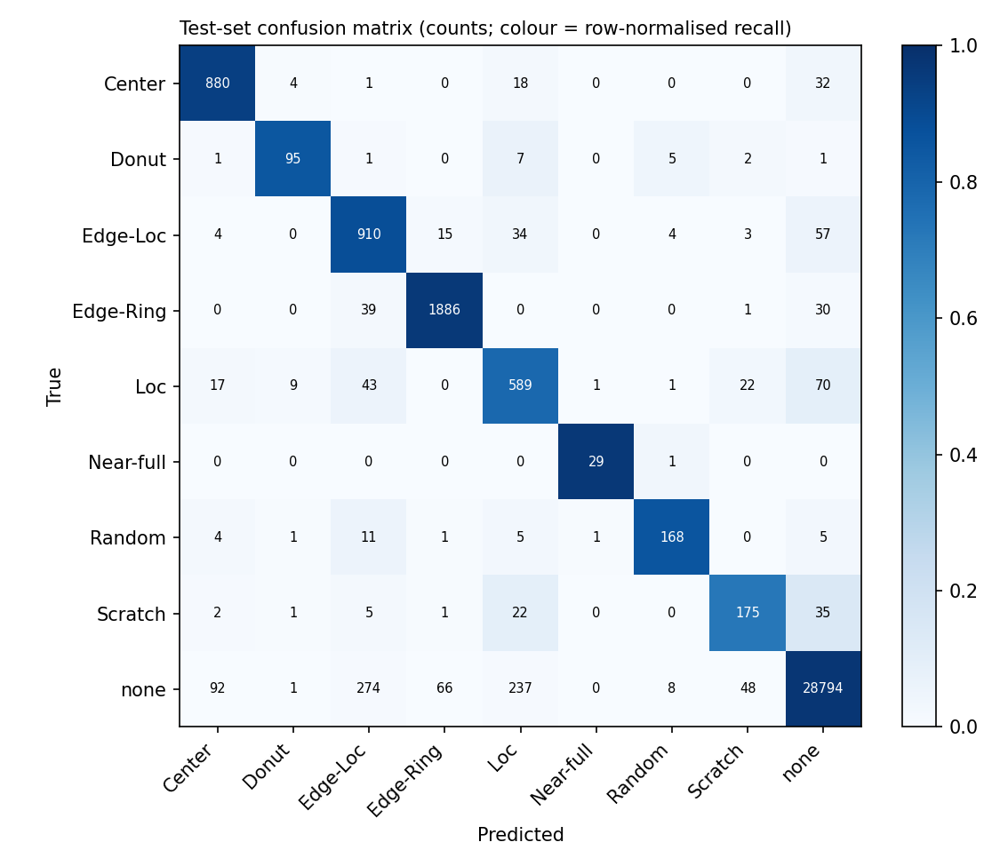
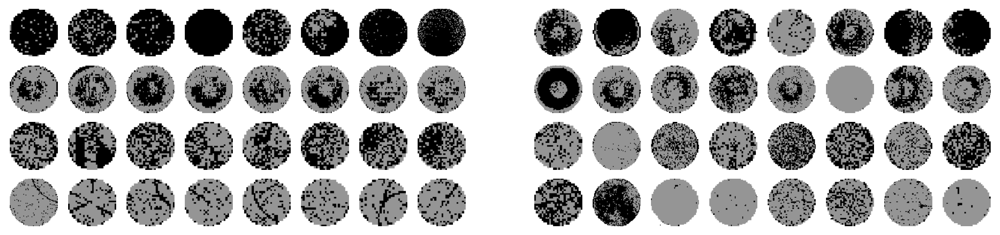

# wafer-defect-cuda


[](https://github.com/Sim2200/wafer-defect-cuda/actions)

Wafer-map defect pattern classification on the public **WM-811K** dataset (811,457 real wafer maps
from a semiconductor fab, 172,950 labelled with one of nine failure patterns), with **custom CUDA
kernels** for preprocessing and filtering written as a PyTorch C++/CUDA extension, and
**multi-GPU training with PyTorch DDP**. Every number below is read from a file under `results/`,
produced by one run on Kaggle's free 2x Tesla T4 (`kaggle/run_all.py`), including the kernels'
correctness checks against PyTorch. `INTERVIEW.md` explains the kernel layout, the tiling result,
the bug the correctness check caught, and the DDP numbers in plain words.

## Why wafer-map patterns matter

After electrical test, every die on a wafer is marked pass or fail. The spatial pattern of the
failures is a fingerprint of the process problem: an **Edge-Ring** points at edge-bead removal or
etch non-uniformity, a **Scratch** at handling, a **Center** blob at deposition or chuck
temperature, **Random** at particle contamination. Classifying the pattern automatically lets yield
engineers route a lot to the right tool owner without inspecting maps by hand. The hard part is
the class balance: **85.2%** of labelled wafers are "none", and the rarest pattern (Near-full) has
149 wafers in the whole dataset.

## Architecture



## Kernel design

All kernels live in `kernels/wafer_ops.cu` and are built with `torch.utils.cpp_extension.load`.

- **Thread/block layout.** A 2-D block of 16x16 threads computes one 16x16 output tile; `grid.x`
  and `grid.y` tile the image and `grid.z` indexes the batch, so one launch covers 1,024 wafers.
  Consecutive threads in a warp own consecutive columns of a row, so global loads and stores are
  **coalesced** into a few 128-byte transactions per warp.
- **Preprocess** (`resize_kernel` + `standardise_kernel`). Wafer maps come in hundreds of sizes
  (26x26 is the most common; see `results/data_summary.json`), so they are packed into one flat
  uint8 buffer with height/width/offset tables. The resize kernel maps each output pixel to its
  source with the nearest-exact rule PyTorch uses, which is what makes an exact comparison
  possible. Standardisation is one block per wafer: each thread accumulates partial sums of x and
  x² over a strided range, a **shared-memory tree reduction** yields mean and variance, and the
  same threads write back `(x - mean) / (std + eps)`.
- **conv3x3 and median3x3**, each in a *naive* version (nine global reads per output pixel,
  boundary handled per pixel: zero padding for the conv, replicate for the median) and a
  **shared-memory tiled** version (each block stages an 18x18 tile, the 16x16 output tile plus a
  one-pixel halo, in shared memory behind one `__syncthreads()`, then reads neighbours from shared
  memory, so each input pixel is fetched from global memory once per tile instead of up to nine
  times). The median is a fixed 19-comparison sorting network: branch-free, no local-memory array.

## Results

Run on 2026-10-03, Kaggle, 2x Tesla T4, torch 2.11.0+cu128, CUDA 12.8, Python 3.13 (`results/env.json`).

### Data (`results/data_summary.json`)

| | Center | Donut | Edge-Loc | Edge-Ring | Loc | Near-full | Random | Scratch | none |
|---|---|---|---|---|---|---|---|---|---|
| All labelled | 4,294 | 555 | 5,189 | 9,680 | 3,593 | 149 | 866 | 1,193 | 147,431 |
| Test set | 935 | 112 | 1,027 | 1,956 | 752 | 30 | 196 | 241 | 29,520 |

172,950 labelled wafers from 10,762 lots, split by lot (no lot straddles train and test),
stratified per class: train 120,876, val 17,305, test 34,769. "none" is 85.2% of the data.

### Kernels: correctness and speed (`results/kernels.json`, `results/cuda_tests.txt`)

Batch of 1,024 real 64x64 wafers, CUDA-event timing, median of 3 repeats of 50 launches each.
Max abs error is against the PyTorch reference on the same batch; the 5 CUDA parity tests in
`tests/test_kernels_cuda.py` passed on the T4 (`cuda_tests.txt`).

| Op | Variant | Max abs error vs PyTorch | ms / batch | Wafers / s |
|---|---|---|---|---|
| conv3x3 | PyTorch (cuDNN) | – | **0.232** | 4,413,111 |
| conv3x3 | CUDA naive | 0.0 | 0.376 | 2,725,172 |
| conv3x3 | CUDA tiled (shared memory) | 0.0 | 0.535 | 1,915,521 |
| median3x3 | PyTorch (unfold + median) | – | 99.109 | 10,332 |
| median3x3 | CUDA naive | 0.0 | **0.143** | 7,148,857 |
| median3x3 | CUDA tiled (shared memory) | 0.0 | 0.289 | 3,548,616 |
| preprocess | PyTorch (per-wafer loop: interpolate + mean/std) | – | 132.061 | 7,754 |
| preprocess | CUDA packed (resize + standardise, 2 launches) | 2.4e-7 | **0.294** | 3,482,379 |

Three honest readings. The custom **median filter is 693x faster** than PyTorch's unfold route
(99.1 vs 0.143 ms), because PyTorch has no fused median and must materialise nine shifted copies of
the batch. The packed **preprocess is 449x faster** than the per-wafer PyTorch loop (132 vs 0.294
ms); part of that gap is Python loop and kernel-launch overhead on the PyTorch side, which is
exactly the overhead a packed kernel removes, but it is not a like-for-like kernel comparison.
And **cuDNN beats both hand-written 3x3 convolutions** (0.232 vs 0.376 ms): a direct convolution
is a teaching kernel next to cuDNN's implicit-GEMM and Winograd paths.

**Tiling did not pay at this size.** For a 3x3 window on 64x64 maps the naive kernels are faster
than the tiled ones (median 0.143 vs 0.289 ms). A 64x64 float map is 16 KB and the T4 has 64 KB of
L1 per SM, so the naive kernel's nine reads per pixel mostly hit L1; the tiled kernel pays for the
halo loads, the barrier and shared-memory traffic to buy a reuse the cache already provided. Tiling
pays when reuse per pixel outgrows L1: larger windows (7x7), larger images, or several filters
sharing one tile. Both versions are kept because measuring this is the point.

**The correctness check earned its keep.** The first run reported max error 1.0 for the tiled
median: in its halo load, `blockIdx.y * TILE + ly - 1` is unsigned arithmetic, so "row minus one"
at the top edge wrapped to a huge value and clamped to the last row. Casting to `int` first fixed
it (commit history has both runs).

### Classification (`results/metrics.json`, `results/run_1gpu.json`)

Compact CNN (4 conv blocks, 390,633 parameters), 6 epochs, batch 256, AdamW + OneCycle, AMP,
inverse-frequency balanced sampling. Held-out test set, 34,769 wafers:

| | Value |
|---|---|
| **Macro-F1** | **0.8601** |
| Macro recall | 0.8831 |
| Accuracy | 0.9642 (the all-"none" baseline would be 0.849) |

| Class | Support | Precision | Recall | F1 |
|---|---|---|---|---|
| Center | 935 | 0.880 | 0.941 | 0.910 |
| Donut | 112 | 0.856 | 0.848 | 0.852 |
| Edge-Loc | 1,027 | 0.709 | 0.886 | 0.788 |
| Edge-Ring | 1,956 | 0.958 | 0.964 | 0.961 |
| Loc | 752 | 0.646 | 0.783 | 0.708 |
| Near-full | 30 | 0.936 | 0.967 | 0.951 |
| Random | 196 | 0.898 | 0.857 | 0.877 |
| Scratch | 241 | 0.697 | 0.726 | 0.711 |
| none | 29,520 | 0.992 | 0.975 | 0.984 |



The misses are the physically ambiguous neighbours: Loc vs Edge-Loc vs none, and faint Scratches
read as none. Balanced sampling trades a little "none" precision (0.992) for defect recall above
0.72 on every class. Validation accuracy swings in the early epochs (OneCycle's peak learning rate
with batch norm) and settles by epoch 4; the final epoch's validation macro-F1 is 0.861.

### Distributed training (`results/ddp_scaling.json`)

Same model, same per-rank batch (256, so the global batch doubles), same 6 epochs; throughput is
wafers seen by all ranks per second, averaged over epochs after the first.

| | 1x T4 | 2x T4 (DDP, NCCL) |
|---|---|---|
| Wafers / s | 10,060.9 | **18,175.7** |
| Mean epoch time (excl. first) | 12.02 s | 6.65 s |
| Total training time | 77.7 s | 45.6 s |
| Test macro-F1 | 0.8601 | 0.8527 |
| Test accuracy | 0.9642 | 0.9608 |

**Speedup 1.807x, scaling efficiency 90.3%.** The missing 10% is the NCCL all-reduce of the
gradients on a model whose steps are short (0.4M parameters, 64x64 inputs). Accuracy is within
run-to-run noise of the single-GPU run; each configuration was trained once (one seed), so the
0.007 F1 gap is not a finding.

### TensorRT: FP32, FP16 and INT8 engines on one T4 (`results/tensorrt_bench.json`, `results/tensorrt_accuracy.json`)

Trained CNN (0.39M parameters) exported to ONNX opset 17, then compiled to TensorRT 10.16 engines for FP32, FP16, and INT8 quantization. INT8 used IInt8EntropyCalibrator2 (entropy calibration via KL divergence) on 512 training wafers, calibration data from train split only. Inputs resident on GPU, 20 warm-up and 100 timed iterations per point, p50 and p95 latency measured on host. Versions: PyTorch 2.11.0+cu128, CUDA 12.8, ONNX Runtime 1.22.0, TensorRT 10.16.1.11, driver 580.178.04.

**Table A: Latency (p50 / p95 ms) and throughput at batch 128**

| Backend | Batch 1 | Batch 8 | Batch 32 | Batch 128 | Wafers/s at 128 |
|---|---|---|---|---|---|
| PyTorch eager fp32 | 0.731 / 0.792 | 0.724 / 0.827 | 1.529 / 1.592 | 5.605 / 5.667 | 22,837 |
| PyTorch autocast fp16 | 1.136 / 1.388 | 1.089 / 1.374 | 1.027 / 1.169 | 3.430 / 3.486 | 37,313 |
| torch.compile fp32 | 0.751 / 1.097 | 0.850 / 1.074 | 1.839 / 1.893 | 4.323 / 4.436 | 29,608 |
| ONNX Runtime CUDA fp32 | 0.308 / 0.484 | 0.446 / 0.483 | 1.549 / 1.583 | 5.724 / 5.776 | 22,364 |
| TensorRT fp32 | 0.312 / 0.341 | 0.400 / 0.427 | 1.029 / 1.058 | 3.999 / 4.120 | 32,002 |
| TensorRT fp16 | 0.164 / 0.218 | 0.171 / 0.225 | 0.329 / 0.365 | 1.354 / 1.414 | 94,536 |
| TensorRT int8 | **0.140** / 0.203 | **0.145** / 0.203 | **0.212** / 0.276 | **0.701** / 0.848 | 182,573 |

**Table B: Accuracy and logit distance**

| Backend | Test macro-F1 | Delta vs PyTorch | Agreement with PyTorch (top-1) | Max abs logit difference |
|---|---|---|---|---|
| PyTorch eager fp32 | 0.8601 | 0.0000 | 1.0000 | 0.0 |
| PyTorch autocast fp16 | 0.8599 | -0.0002 | 0.9999 | 0.04016 |
| torch.compile fp32 | 0.8601 | 0.0000 | 1.0000 | 0.00004 |
| ONNX Runtime CUDA fp32 | 0.8601 | 0.0000 | 1.0000 | 0.00005 |
| TensorRT fp32 | 0.8601 | 0.0000 | 1.0000 | 0.00004 |
| TensorRT fp16 | 0.8600 | -0.0001 | 0.9999 | 0.05139 |
| TensorRT int8 | 0.8618 | 0.0017 | 0.9970 | 6.36202 |

Engine build times and sizes: FP32 4.4 seconds and 1.9 MB; FP16 8.1 seconds and 0.87 MB; INT8 18.0 seconds and 0.47 MB. INT8 calibration used IInt8EntropyCalibrator2 with 512 train wafers, batch 32, on train split only.

Did INT8 help on a 0.39M-parameter model at 64x64? At batch 32, TensorRT INT8 runs 1.6x faster than FP16 and 7.2x faster than PyTorch eager, reaching 150,770 wafers/s. At batch 128, INT8 is 1.9x faster than FP16 and 8.0x faster than PyTorch eager, reaching 182,573 wafers/s. At batch 1, launch overhead dominates: INT8 at 0.140 ms vs FP16 at 0.164 ms is a modest 17% gap. Accuracy: INT8 macro-F1 0.8618 vs PyTorch FP32 0.8601, a delta of 0.0017 well within run-to-run noise; top-1 agreement 99.70%. FP16 macro-F1 is 0.8600. GPU memory usage is flat across engines at about 1.6 GiB, dominated by the CUDA context. torch.compile was not faster than eager in this run at batches 1, 8 and 32 (0.731 ms vs 0.751 ms at batch 1, 1.529 ms vs 1.839 ms at batch 32), faster only at batch 128 (5.605 ms vs 4.323 ms).

Nsight Systems (`results/nsight_summary.md`): the custom median3x3 tiled kernel runs in 500.7 us per launch on 1,024 wafers. For the TensorRT FP16 engine at batch 128, the trace shows where the time goes: the convolutions run as tensor-core kernels (`sm75_xmma_fprop_implicit_gemm` 20.7% of GPU time and three `trt_turing_h1688cudnn` kernels at 17.9%, 17.4% and 15.4%, about 71% together), max-pooling takes about 22% (`xmma_pooling` kernels, 18.7% and 3.1%) and the NCHW to NHWC format conversion 5.4%; the final linear layer is 0.7%. On a model this small the pooling and layout kernels are a large share of the engine's time, which is why batch 1 is launch-bound. Nsight Compute metrics for the median kernel are collected in a profiling-only run (`--experiment nsight`); see the summary file for what it reports.

### Diffusion for rare classes: did synthetic wafers help? (`results/diffusion_*.json`)

Class-conditional DDPM trained with HF diffusers UNet2DModel (25,304,961 parameters, channels [64, 128, 256, 256], 1000 timesteps, squaredcos_cap_v2 schedule, 0.999 EMA) on the lot-grouped train split only, on the eight defect classes (17,790 train wafers, 60 epochs, 80.05 minutes total on 2x T4 with DDP). Sampling: 2,000 wafers per rare class (Near-full, Donut, Random, Scratch) with DDIM 50 steps at 5.9 wafers/s. Pixels scaled to [-1, 1] and rounded back to the three levels.

**Are the samples copies? (median nearest-neighbour distance to train set, fraction differing pixels)**

| Class | Train | Generated | Median distance generated | Median distance real test | Threshold | Near-copy % (generated) | Near-copy % (real test) |
|---|---|---|---|---|---|---|---|
| Near-full | 101 | 2,000 | 0.099 | 0.0884 | 0.0000 | 0.0 | 6.7 |
| Donut | 397 | 2,000 | 0.1526 | 0.1428 | 0.0796 | 20.1 | 1.79 |
| Random | 556 | 2,000 | 0.2471 | 0.2677 | 0.0000 | 0.0 | 2.04 |
| Scratch | 846 | 2,000 | 0.1361 | 0.0769 | 0.0007 | 0.0 | 1.24 |

Generated wafers sit about as far from the train set as unseen real wafers do, so the model is not memorising. Note Donut's 20.1% near copies against a loose threshold (0.0796) and that 6.7% of Near-full test wafers are exact duplicates of train wafers (threshold 0.0000), a property of the dataset.

**Sample quality (feature-FID on the classifier's 256-d penultimate features, lower is better)**

| Class | Generated vs real test | Real train vs real test | Generated vs real train | Fail-pixel share (real train) | Fail-pixel share (generated) |
|---|---|---|---|---|---|
| Near-full | 46.261 | 6.121 | 50.955 | 0.6818 | 0.5034 |
| Donut | 20.65 | 8.915 | 26.119 | 0.2166 | 0.2316 |
| Random | 15.831 | 5.028 | 22.386 | 0.3764 | 0.3235 |
| Scratch | 49.381 | 10.157 | 72.566 | 0.0771 | 0.1709 |

FID of generated samples is 2 to 8x the real-train-vs-test floor. Scratch samples have 2.2x the fail-pixel density of real scratches (0.1709 vs 0.0771); Near-full samples have too few fail pixels (0.5034 vs 0.6818).

**Step count (256 per class): DDPM vs DDIM trade-off**

| Schedule | Steps | Wafers / s | FID: Near-full | FID: Donut | FID: Random | FID: Scratch |
|---|---|---|---|---|---|---|
| DDPM | 1000 | 0.3 | 18.357 | 25.474 | 18.113 | 45.706 |
| DDIM | 50 | 5.87 | 49.065 | 16.964 | 14.509 | 54.773 |
| DDIM | 10 | 28.1 | 155.343 | 20.733 | 51.47 | 37.383 |

DDPM 1000 is 20x slower than DDIM 50 and only better for Near-full. DDIM 10 is 4.8x faster than DDIM 50 and much worse for Near-full (155.343 vs 49.065) and Random (51.47 vs 14.509).

**Classifier experiment (same recipe, 6 epochs, 3 seeds, mean ± std)**

| Condition | Test macro-F1 | Accuracy | Recall: Near-full | Recall: Donut | Recall: Random | Recall: Scratch | Synthetic wafers |
|---|---|---|---|---|---|---|---|
| Baseline | 0.8597 ± 0.0008 | 0.9643 ± 0.0003 | 0.9667 ± 0.0000 | 0.8661 ± 0.0146 | 0.8895 ± 0.0237 | 0.6749 ± 0.0393 | 0 |
| Flips | 0.8231 ± 0.0036 | 0.9441 ± 0.0019 | 0.9889 ± 0.0157 | 0.9494 ± 0.0111 | 0.9252 ± 0.0064 | 0.8949 ± 0.0052 | 0 |
| Oversample x4 | 0.8581 ± 0.0049 | 0.9651 ± 0.0012 | 0.9667 ± 0.0272 | 0.8541 ± 0.0256 | 0.8895 ± 0.0210 | 0.6459 ± 0.0128 | 0 |
| Synthetic 500 | 0.8201 ± 0.0029 | 0.9617 ± 0.0011 | 0.8778 ± 0.0157 | 0.875 ± 0.0073 | 0.8622 ± 0.0083 | 0.6432 ± 0.0034 | 2,000 |
| Synthetic 2000 | 0.7737 ± 0.0041 | 0.9542 ± 0.0014 | 0.8222 ± 0.0314 | 0.8899 ± 0.0367 | 0.8571 ± 0.0110 | 0.6943 ± 0.0249 | 8,000 |

Adding synthetic wafers lowered macro-F1 from 0.8597 (baseline) to 0.8201 with 500 per class and 0.7737 with 2,000, well outside the seed spread (baseline std 0.0008 vs effects of 0.04 to 0.09 macro-F1 points). The samples look plausible but shift the class boundaries, consistent with the FID gap and the fail-pixel mismatch. Oversampling did nothing (0.8581 vs 0.8597). Flips raised rare-class recall substantially (Scratch 0.6749 to 0.8949, Donut 0.8661 to 0.9494, Near-full 0.9667 to 0.9889) but lowered macro-F1 to 0.8231 because precision fell: more real wafers of other classes were pulled into the rare classes. With this generator and this classifier recipe, synthetic data is not a substitute for real rare wafers. Next experiments: train the DDPM longer or only on rare classes, filter samples by the classifier's confidence or by FID, mix a smaller share, or tune flips with a precision constraint.



## Limitations

- Tesla T4s (Turing, 2018), not A100/H100; one node; no NVLink. Scaling across nodes is untested.
- 6 epochs, one seed per configuration, no hyper-parameter search; macro-F1 would move by a point
  or two across seeds, and Near-full's per-class numbers rest on 30 test wafers.
- 85% "none" is the dataset's reality; balanced sampling changes the training distribution, not
  the test set, and the reported "none" precision/recall reflect that trade.
- The preprocess speedup includes PyTorch-side Python overhead; the conv comparison shows the
  custom kernels lose to cuDNN, and tiling did not help at 3x3 / 64x64. The Nsight Systems trace of the median kernel is in; the TensorRT trace and the Nsight Compute metrics are pending a re-run (see the TensorRT section).
- The generator was trained once (60 epochs, one seed) and judged by one classifier recipe; the negative result is for this setup.

## Running it

```bash
make setup && make test                  # CPU unit tests (CUDA parity tests skip without a GPU)
python scripts/run_on_kaggle.py --user <kaggle-username> --epochs 6
# pushes src/ kernels/ tests/ as a private Kaggle dataset, runs kaggle/run_all.py on 2x T4,
# waits, and pulls results/*.json, confusion_matrix.png and cuda_tests.txt back (about 6 minutes)
python scripts/run_on_kaggle.py --user <kaggle-username> --experiment trt
# builds and benchmarks TensorRT FP32, FP16 and INT8 engines on one T4
python scripts/run_on_kaggle.py --user <kaggle-username> --experiment diffusion
# 2x T4, about 3 GPU-hours; a finished run's checkpoint and samples can be re-attached as the
# dataset wafer-defect-cuda-ddpm to redo only the evaluation, see `--push-ddpm`.
```

Needs a Kaggle account with phone verification (for GPUs) and the Kaggle CLI authenticated
(`~/.kaggle/access_token` or `kaggle.json`; never committed). On a machine with an NVIDIA GPU the
same steps run locally: `python -m wafer.bench_kernels ...`, `python -m wafer.train ...`,
`torchrun --nproc_per_node=2 -m wafer.train ...`.

## Layout

```
src/wafer/     data.py (load, lot-grouped split) · reference.py (PyTorch references) · kernels.py (extension wrapper)
               model.py · sampler.py (DistributedBalancedSampler) · train.py (DDP, AMP) · bench_kernels.py · metrics.py
               trt_bench.py · profile_targets.py · diffusion.py · synth.py
kaggle/        run_all.py (the whole experiment on one kernel) · run_trt.py · run_diffusion.py
               scripts/run_on_kaggle.py (push, poll, pull)
tests/         CPU tests (23) + CUDA parity tests (5, run on Kaggle)
               test_synth.py · test_train_options.py
results/       data_summary · kernels · metrics · run_1gpu · run_2gpu · ddp_scaling · env · cuda_tests.txt · confusion_matrix.png
               diffusion_train · diffusion_samples · diffusion_experiment · figures/diffusion_grid.png
```

## Author

**Simran Kharbanda** · [github.com/Sim2200](https://github.com/Sim2200)
